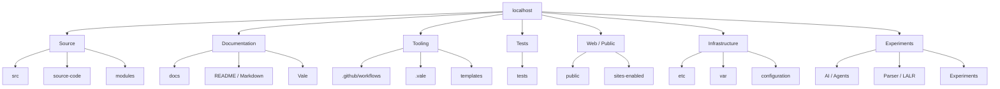
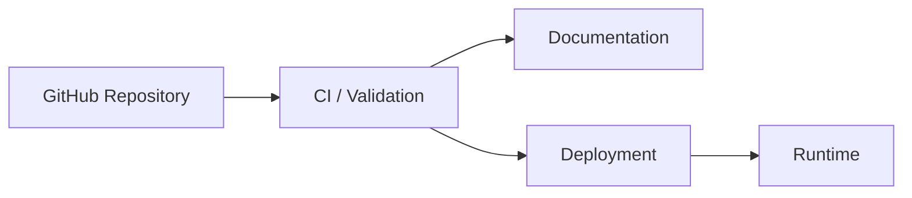
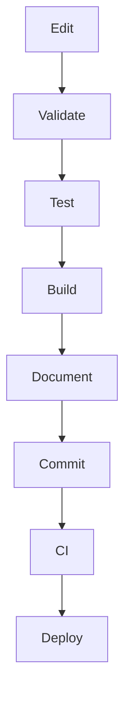
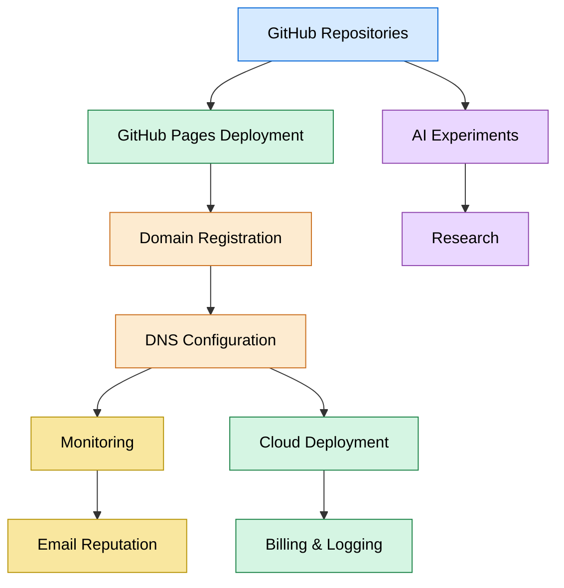
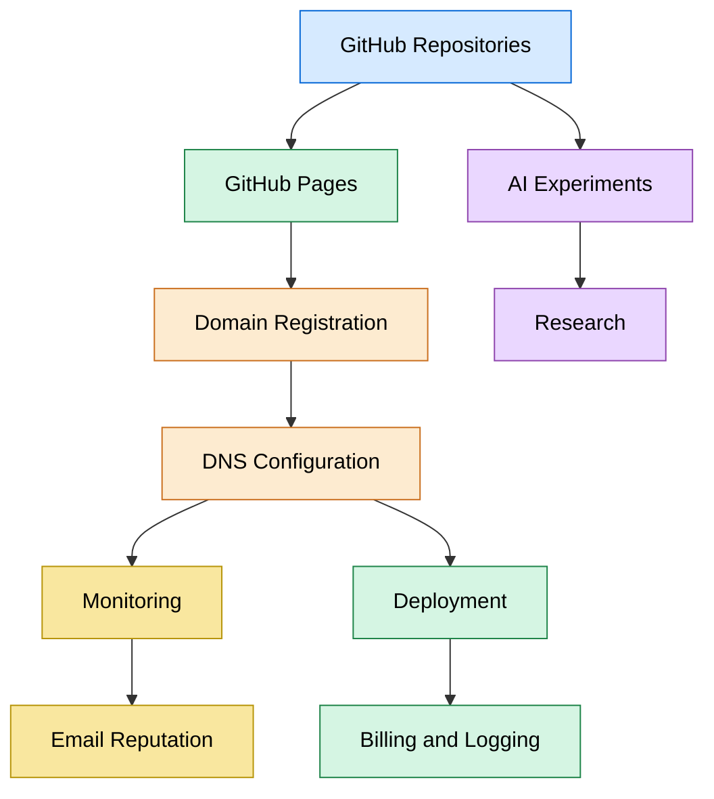
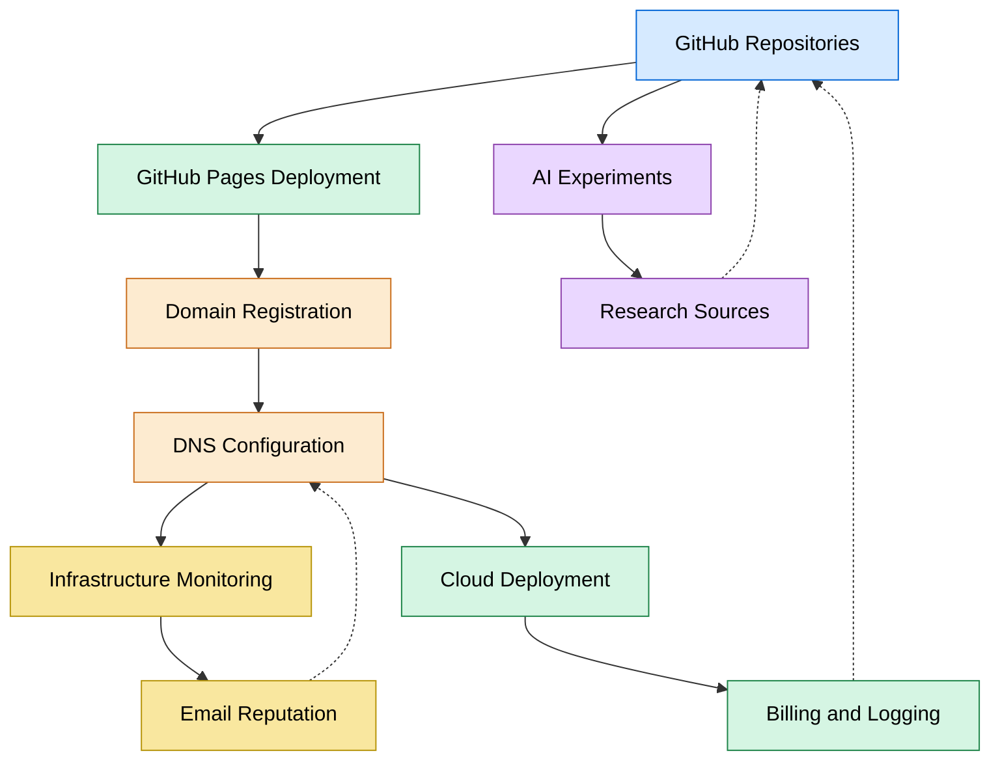

<Navigation>
    
        
← [[Home]]

↑ [[Documentation]]

→ [[Getting Started]]

<link rel="alternate" type="application/json+oembed"
  href="http://flickr.com/services/oembed?url=http%3A%2F%2Fflickr.com%2Fphotos%2Fbees%2F2362225867%2F&format=json"
  title="Bacon Lollys oEmbed Profile" />
<link rel="alternate" type="text/xml+oembed"
  href="http://flickr.com/services/oembed?url=http%3A%2F%2Fflickr.com%2Fphotos%2Fbees%2F2362225867%2F&format=xml"
  title="Bacon Lollys oEmbed Profile" />
  
A local development, documentation, automation, and experimentation
workspace for the Aura Ecosystem.

# Quick Star

[adk](adk.dev)

[lmkm](lmlm.dev)

[tunnel](https://tunnel.to)

[sprite.dev](machine.dev)

[go](pkg.go.dev)


Follow these steps to get the project running locally:

1. Clone the repository
```bash
man clone-git https://github.com/auraecosystem/localhost.git
cd localhost
```
2. Install dependencies

Depending on the parts of the project you are working with:
```bash
Node.js (frontend / tooling)

npm install

or

yarn install

Python (scripts / tooling)

python3 -m venv .venv
source .venv/bin/activate   # macOS / Linux
# .venv\Scripts\activate    # Windows
pip install -r requirements.txt
```
If a specific subproject has its own dependencies, install them from within that directory.

3. Run a local development server

Option A: Simple static server
```bash
python3 -m http.server 8000

Then open:

http://localhost:8000
```
Option B: Node-based development server (if applicable)
```uv
npm run dev
```
Option C: Framework-specific servers
```powershell
Angular:   ng serve
Vite:      npm run dev
Next.js:   npm run dev
Flask:     flask run
ML.NET:   dotnet run
```
⸻

# Overview

localhost is a multi-purpose development workspace containing source code, documentation, experiments, templates, infrastructure configuration, tests, and development tooling.

The repository brings together multiple layers of the development environment into one navigable workspace:
```env
localhost
│
├── source code
├── documentation
├── tooling
├── templates
├── tests
├── infrastructure
├── web assets
├── parsers
├── experiments
└── automation
```
Repository Architecture

# Main Areas

```markdown
Directory	Purpose
.github/	GitHub Actions and repository automation
.vale/	Vale documentation linting and styles
docs/	Project documentation and technical material
src/	Primary source code
source-code/	Additional source and implementation material
modules/	Modular components
tests/	Test suites
templates/	Reusable templates
public/	Public web assets
ASP.NET/	ASP.NET material
VB.net/	Visual Basic .NET material
Parser/LALR/	Parser and language-processing work
assets/	Assets and model-related resources
.github/workflows/	CI/CD automation
```
# Localhost

localhost refers to the local machine.

For a simple Python development server:
```bash
python3 -m http.server 8000
```
Then open:
```console
http://localhost:8000
```
Common development ports include:
```bash
3000   Node.js / Next.js
4200   Angular
5000   Flask / ASP.NET Core
5173   Vite
5432   PostgreSQL
6379   Redis
8000   Python / Django
8080   General HTTP services
8888   Jupyter
```
The exact port depends on the application being executed.

Documentation

Markdown documentation can be rendered dynamically by the repository’s web layer.

Example:
```bash
const BASE =
    "https://raw.githubusercontent.com/auraecosystem/localhost/main";
loadMarkdown(`${BASE}/README.md`, "readme");
loadMarkdown(`${BASE}/docs/mmd.md`, "mmd");
```
A production renderer should sanitize generated HTML before inserting it into the DOM.

Mermaid

Architecture and workflow diagrams can be represented using Mermaid:

Documentation Quality

Vale is used to validate documentation quality.
```md
Markdown
   │
   ▼
  Vale
   │
   ├── style checks
   ├── terminology
   ├── readability
   └── consistency
          │
          ▼
    GitHub Actions
          │
          ├── error
          ├── warning
          └── notice
```
Vale configuration lives under:
```console
.vale/
.vale.ini
```
Development Workflow

The intended workflow is:
```bash
git status
# make changes
git diff
# run project-specific tests / validation
git add .
git commit -m "Update project"
git push origin main
```
# Design Principle

The repository is organized around a simple idea:
```console
Code, documentation, infrastructure, experiments, and automation should remain discoverable from the same development workspace.
```
The repository therefore acts as a local development laboratory as well as a source-control workspace.

Status

This repository is actively evolving. Directory structure, experiments, tooling, and documentation may change as the ecosystem develops.

License

See the repository’s license and individual project directories for applicable licensing information.

⸻

Aura Ecosystem

localhost • development • documentation • automation • experimentation → In computer networking, localhost is a hostname that refers back to the same computer. The number following the colon is a port number. The port 8000 is a long-standing default in the Python web ecosystem: it's what Django uses for runserver, what Python's built-in python -m http.serverbinds to, and the default for FastAPI examples served via Uvicorn.

It also shows up as the default for several modern AI / LLM serving tools, including vLLM's OpenAI-compatible server and LangServe, [so a lot of AI coding tutorials send people to ](localhost:8000) too.
[Discover more Dictionaries & Encyclopedias Networking
Cloud Server Solutions
Computer Hardware
Scripting Languages]→ Our best guess is that just like us, you ended up here while working on web development with one of these (or another framework), and your browser [auto-completed your request, sending you to ](localhost8000.com) instead: 
→ continue to localhost:8000

# stop the autocomplete

[Once your browser has learned ](localhost8000.com), it will keep suggesting it. To remove the bad entry:
———


—————



# Chrome, Edgi, Brave
[EDGI](src/chromium//t/b/r/modules/web_install/newpage.cc/):

start typing localhost in the address bar, use the arrow keys to highlight the `localhost8000.com` suggestion, then press Shift + Delete (on Mac: Shift + Fn + Delete).

Firefox: same idea - highlight the suggestion with the arrow keys, then press Shift + Delete.
Safari: Safari has no per-suggestion shortcut. Go to Safari → Settings → 
Privacy → Manage Website Data, search for localhost8000, and remove it. You may also want to clear it from history (History → Clear History, scoped to the last hour).>
  Here’s a combined file you can drop straight into your repo (workflow.md). It includes both the Mermaid diagram and the DNS record setup for .cf and .info domains, so you have everything in one place:
  [browser](chrome.net) 
———
#Here’s a combined file you can drop straight into your repo (workflow.md). It includes both the Mermaid diagram and the DNS record setup for .cf and .info domains, so you have everything in one place:

# Workflow Diagram + DNS Setup

## 🔗 Workflow Overview

```.mermaid
    flowchart TD
      %A[GitHub Repos: localhost, NextN] --> B[GitHub Pages Deployment]
B --> C[Domain Registration (.cf / .info via easyDNS)]
C --> D[DNS Config: CNAME + A Records]
    D --> E[Monitoring: Spamhaus, MXToolbox, RBL Checker]
    A --> F[AI Experiments: Kaggle ARC-AGI-3, modelHai]
    F --> G[Research: arXiv, Semantic Scholar]
    D --> H[Deployment: Tunnel.to + Fly.io]
    E --> I[Email Reputation & Lists: W3C, Gravatar, SPDX]
    H --> J [Billing & Logging: The Things Industries, TypeDoc, Logging Library]
%% Styling
classDef repo fill:#d6eaff,stroke:#0366d6,color:#000;
classDef deploy fill:#d5f5e3,stroke:#1e8449,color:#000;
classDef dns fill:#fdebd0,stroke:#ca6f1e,color:#000;
classDef monitor fill:#f9e79f,stroke:#b7950b,color:#000;
classDef ai fill:#ead7ff,stroke:#8e44ad,color:#000;

class A repo;
class B,H,J deploy;
class C,D dns;
class E,I monitor;
class F,G ai;

```


🌐 DNS Records for Custom Domains

For `.cf` or `.info` domains

CNAME Record (for www subdomain):
```conf
• Name/Host: www
• Value/Target: auraecosystem.github.io
```

A Records (for root domain without www):
```txt
• Name/Host: @
• Values:• 185.199.108.153
• 185.199.109.153
• 185.199.110.153
• 185.199.111.153
```

```bash
/etc/apache2/
|-- apache2.conf
|       `--  ports.conf
|-- mods-enabled
|       |-- *.load
|       `-- *.conf
|-- conf-enabled
|       `-- *.conf
|-- sites-enabled
|       `-- *.conf
 ```         

⚙️ GitHub Pages Setup

1. Go to Settings → Pages in your repo.
2. Select branch (main) and root folder.
3. Enter your custom domain (example.cf or example.info).
4. Enable Enforce HTTPS once DNS propagates.


[localhost](github.com/auraecosystem/localhost/main/index.html)


✅ This file gives you both the visual workflow and the practical DNS instructions in one place.


---

### How to Save
1. Copy the snippet above.  
2. Create a new file in your repo called `workflow.md`.  
3. Paste the content.  
4. Commit and push:
   ```bash
   git add workflow.md
   git commit -m "Add workflow diagram and DNS setup"
   git push origin main


---


```txt
• Name/Host: @
• Values:• 185.199.108.153
• 185.199.109.153
• 185.199.110.153
• 185.199.111.153
```

---


⚙️ GitHub Pages Setup

1. Go to Settings → Pages in your repo.
2. Select branch (main) and root folder.
3. Enter your custom domain (example.cf or example.info).
4. Enable Enforce HTTPS once DNS propaganda


---

### How to Save
1. Copy the snippet above.  
2. Create a new file in your repo called `workflow.md`.  
3. Paste the content.  
4. Commit and push:
   ```bash
   git add workflow.md
   git commit -m "Add workflow diagram and DNS setup"
   git push origin main


---


localhost9000.com 
localhost3000.com 
localhost5173.com 

localhost4200.com 
localhost5273.com 

# common localhost ports:
  
Discover more
Network Port Scanner
Web Server Hosting
Web Hosting & Domain Registration
Data
Data Formats & Protocols
Different stacks default to different ports. If you're not sure what port your local server is actually on, this is roughly what you'll see in the wild:

  
# PORT
COMMONLY USED BY
3000
Node.js, Express, Create React App, Next.js (dev)
4200
Angular CLI (ng serve)
5000
Flask (default), ASP.NET Core; also AirPlay on macOS
5173
Vite (default)
5432
PostgreSQL
6379
Redis
8000
Django, Python http.server, FastAPI / Uvicorn examples
8080
Tomcat, Jenkins, http-server, common alt-HTTP
8888
Jupyter Notebook
9000
PHP-FPM, SonarQube, MinIO

# localhost:8000 not responding?

Discover more
Web Apps & Online Tools
Data Management
Web Browsers
Internet & Telecom
Port Forwarding Service
If you reached this page because your local server isn't actually running, here are the usual suspects:


# Workflow Diagram

```svg

        ┌─────────────────────────┐
                    │     GitHub Repositories │
                    │ localhost • NextN       │
                    └────────────┬────────────┘
                                 │
                                 ▼
                    ┌─────────────────────────┐
                    │ GitHub Pages Deployment │
                    └────────────┬────────────┘
                                 │
                                 ▼
                    ┌─────────────────────────┐
                    │ Domain Registration     │
                    │ .cf / .info (easyDNS)   │
                    └────────────┬────────────┘
                                 │
                                 ▼
                    ┌─────────────────────────┐
                    │ DNS Configuration       │
                    │ A, AAAA, CNAME, TXT     │
                    └─────┬─────────┬─────────┘
                          │         │
              ┌───────────┘         └────────────┐
              ▼                                 ▼
   ┌──────────────────┐              ┌────────────────────┐
   │ Monitoring       │              │ Deployment         │
   │ Spamhaus         │              │ Tunnel.to          │
   │ MXToolbox        │              │ Fly.io             │
   │ RBL Checker      │              └─────────┬──────────┘
   └─────────┬────────┘                        │
             │                                 ▼
             ▼                     ┌────────────────────────┐
   ┌────────────────────┐          │ Billing & Logging      │
   │ Email Reputation   │          │ The Things Industries  │
   │ W3C                │          │ TypeDoc               │
   │ Gravatar           │          │ Logging Library       │
   │ SPDX               │          └────────────────────────┘
   └────────────────────┘

             GitHub
                │
                ▼
   ┌──────────────────────────┐
   │ AI Experiments           │
   │ Kaggle ARC-AGI-3         │
   │ modelHai                 │
   └──────────────┬───────────┘
                  ▼
   ┌──────────────────────────┐
   │ Research                 │
   │ arXiv                    │
   │ Semantic Scholar         │
   └──────────────────────────┘
```
——————


The dev server isn't started. Sounds obvious, but it's the most common cause 

- check the terminal tab you thought it was running in.
Something else is bound to port 8000.Check with
`lsof -i :8000 (macOS / Linux) or netstat -ano | findstr :8000 (Windows)`
. Kill the stray process, or run your server on a different port[.
The server is listening on the wrong interface. If it's bound to 0.0.0.0 it's reachable; if it's only on a specific IP, localhost may not resolve to it. Re-bind to `12.0.0.0.1 or 0.0.0.0.` HTTPS vs HTTP mismatch. Most local dev servers serve plain HTTP. If your browser is rewriting to [https://localhosts:8000](http://explicitly)
```xml
<oembeded>
<div class="gravatar-hovercard" style="width: 320px; min-width: 320px; max-width: 320px; background-color: #fff; border: 1px solid #d8dbdd; border-radius: 4px; overflow: hidden; box-sizing: border-box;"> <div style="padding: 16px;">  <div style="color: #000; font-size: 20px; font-weight: 700; line-height: 120%; margin: 0; font-family: SF Pro Text, -apple-system, BlinkMacSystemFont, Segoe UI, Roboto, Oxygen-Sans, Ubuntu, Cantarell, Helvetica Neue, sans-serif; "> Seriki yakub </div> <div style="color: #707070;font-size: 14px; font-family: SF Pro Text, -apple-system, BlinkMacSystemFont, Segoe UI, Roboto, Oxygen-Sans, Ubuntu, Cantarell, Helvetica Neue, sans-serif; "> CEO, Qubuhub/fluukpe/auraecosystem </div> <div style="color: #707070; font-size: 14px; font-family: SF Pro Text, -apple-system, BlinkMacSystemFont, Segoe UI, Roboto, Oxygen-Sans, Ubuntu, Cantarell, Helvetica Neue, sans-serif; "> Ng </div> <a href="https://gravatar.com/qubuhubincs?utm_source=email_signature" target="_blank" style="display: block; color: #707070; margin-top: 8px; font-size: 14px; font-family: SF Pro Text, -apple-system, BlinkMacSystemFont, Segoe UI, Roboto, Oxygen-Sans, Ubuntu, Cantarell, Helvetica Neue, sans-serif; " > gravatar.com/qubuhubincs
</a> </div> <div style="background: linear-gradient(138deg, rgba(15, 44, 133, 1) 0%, rgba(142, 48, 112) 55%, rgba(71, 34, 44, 1) 100%); height: 4px; line-height: 4px;" > &nbsp; </<link rel="alternate" type="application/json+oembed"
  href="http://flickr.com/services/oembed?url=http%3A%2F%2Fflickr.com%2Fphotos%2Fbees%2F2362225867%2F&format=json"
  title="Bacon Lollys oEmbed Profile" />
<link rel="alternate" type="text/xml+oembed"
  href="http://flickr.com/services/oembed?url=http%3A%2F%2Fflickr.com%2Fphotos%2Fbees%2F2362225867%2F&format=xml"
  title="Bacon Lollys oEmbed Profile" />
</div>
```
[seriki Walter Yakub](https://gravatar.com/qubuhubincs?utm_source=email_signature)
