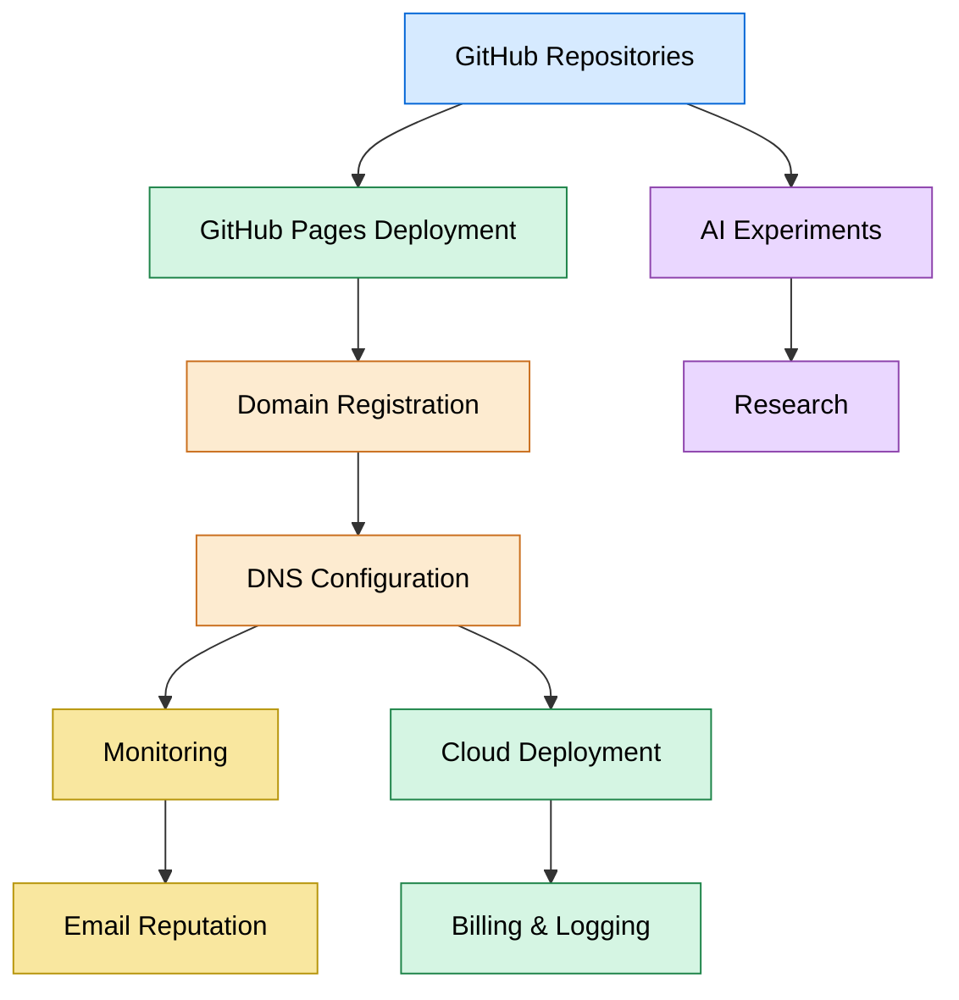
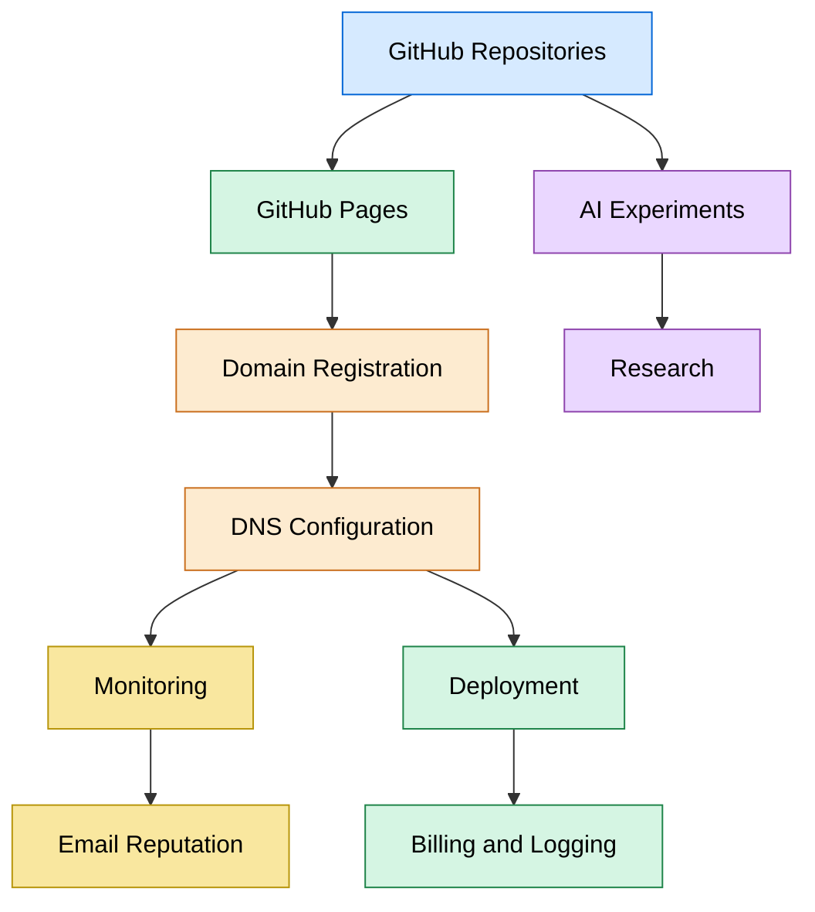
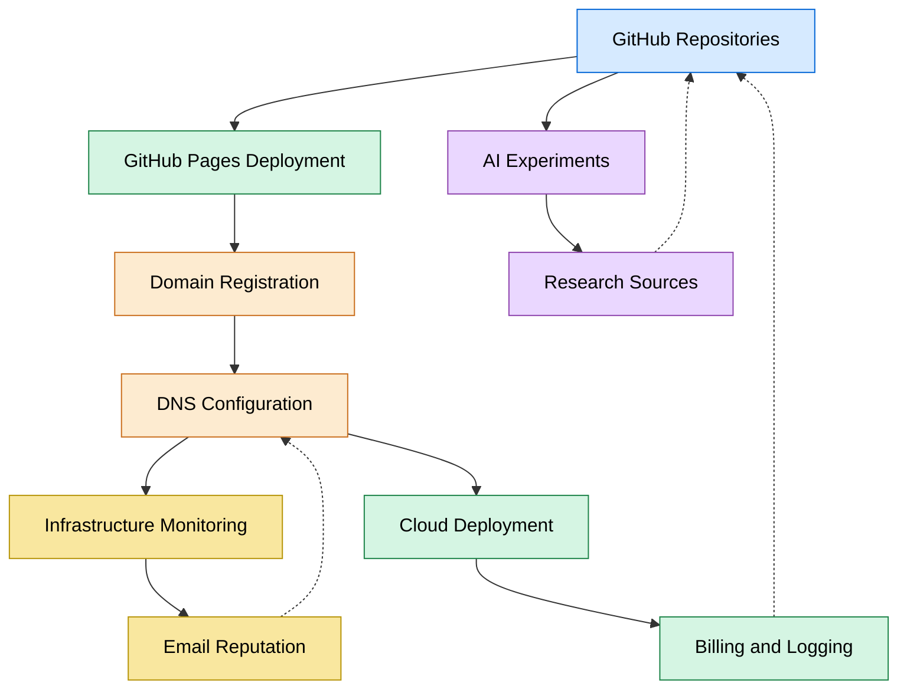
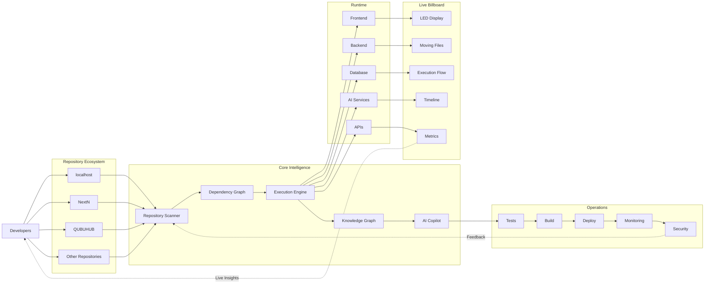

# host

```bash
# you wanted:
$ open https://localhost:8000
# you got:
$ open https://localhost8000.com
localhost:8000
python3 -m http.server 8000
```
  You probably meant to go to localhost:8000, and ended up here by accident.

→ In computer networking, localhost is a hostname that refers back to the same computer. The number following the colon is a port number. The port 8000 is a long-standing default in the Python web ecosystem: it's what Django uses for runserver, what Python's built-in python -m http.serverbinds to, and the default for FastAPI examples served via Uvicorn.

It also shows up as the default for several modern AI / LLM serving tools, including vLLM's OpenAI-compatible server and LangServe, so a lot of AI coding tutorials send people to localhost:8000 too.

Discover more Dictionaries & Encyclopedias Networking
Cloud Server Solutions
Computer Hardware
Scripting Languages

→ Our best guess is that just like us, you ended up here while working on web development with one of these (or another framework), and your browser auto-completed your request, sending you to localhost8000.com instead :)

→ continue to localhost:8000
# stop the autocomplete

Once your browser has learned localhost8000.com, it will keep suggesting it. To remove the bad entry:
———


—————



# Chrome, Edge, Brave (any Chromium):

start typing localhost in the address bar, use the arrow keys to highlight the localhost8000.com suggestion, then press Shift + Delete (on Mac: Shift + Fn + Delete).

Firefox: same idea - highlight the suggestion with the arrow keys, then press Shift + Delete.
Safari: Safari has no per-suggestion shortcut. Go to Safari → Settings → 
Privacy → Manage Website Data, search for localhost8000, and remove it. You may also want to clear it from history (History → Clear History, scoped to the last hour).>
  Here’s a combined file you can drop straight into your repo (workflow.md). It includes both the Mermaid diagram and the DNS record setup for .cf and .info domains, so you have everything in one place:
  
———
#Here’s a combined file you can drop straight into your repo (workflow.md). It includes both the Mermaid diagram and the DNS record setup for .cf and .info domains, so you have everything in one place:

# Workflow Diagram + DNS Setup

## 🔗 Workflow Overview

```.mermaid
    flowchart TD
      %A[GitHub Repos: localhost, NextN] --> B[GitHub Pages Deployment]
B --> C[Domain Registration (.cf / .info via easyDNS)]
C --> D[DNS Config: CNAME + A Records]
    D --> E[Monitoring: Spamhaus, MXToolbox, RBL Checker]
    A --> F[AI Experiments: Kaggle ARC-AGI-3, modelHai]
    F --> G[Research: arXiv, Semantic Scholar]
    D --> H[Deployment: Tunnel.to + Fly.io]
    E --> I[Email Reputation & Lists: W3C, Gravatar, SPDX]
    H --> J [Billing & Logging: The Things Industries, TypeDoc, Logging Library]
%% Styling
classDef repo fill:#d6eaff,stroke:#0366d6,color:#000;
classDef deploy fill:#d5f5e3,stroke:#1e8449,color:#000;
classDef dns fill:#fdebd0,stroke:#ca6f1e,color:#000;
classDef monitor fill:#f9e79f,stroke:#b7950b,color:#000;
classDef ai fill:#ead7ff,stroke:#8e44ad,color:#000;

class A repo;
class B,H,J deploy;
class C,D dns;
class E,I monitor;
class F,G ai;

```


🌐 DNS Records for Custom Domains

For `.cf` or `.info` domains

CNAME Record (for www subdomain):
```txt
• Name/Host: www
• Value/Target: auraecosystem.github.io


A Records (for root domain without www):

• Name/Host: @
• Values:• 185.199.108.153
• 185.199.109.153
• 185.199.110.153
• 185.199.111.153

---
```

⚙️ GitHub Pages Setup
``
1. Go to Settings → Pages in your repo.
2. Select branch (main) and root folder.
3. Enter your custom domain (example.cf or example.info).
4. Enable Enforce HTTPS once DNS propagates.
``
[localhost]
(github.com/auraecosystem/localhost/main/index.html)
---

✅ This file gives you both the visual workflow and the practical DNS instructions in one place.


---

### How to Save
1. Copy the snippet above.  
2. Create a new file in your repo called `workflow.md`.  
3. Paste the content.  
4. Commit and push:
   ```bash
   git add workflow.md
   git commit -m "Add workflow diagram and DNS setup"
   git push origin main


---


```txt
• Name/Host: @
• Values:• 185.199.108.153
• 185.199.109.153
• 185.199.110.153
• 185.199.111.153
```

---


⚙️ GitHub Pages Setup

1. Go to Settings → Pages in your repo.
2. Select branch (main) and root folder.
3. Enter your custom domain (example.cf or example.info).
4. Enable Enforce HTTPS once DNS propaganda


---

### How to Save
1. Copy the snippet above.  
2. Create a new file in your repo called `workflow.md`.  
3. Paste the content.  
4. Commit and push:
   ```bash
   git add workflow.md
   git commit -m "Add workflow diagram and DNS setup"
   git push origin main


---


localhost9000.com 
localhost3000.com 
localhost5173.com 

localhost4200.com 
localhost5273.com 

# common localhost ports:
  
Discover more
Network Port Scanner
Web Server Hosting
Web Hosting & Domain Registration
Data
Data Formats & Protocols
Different stacks default to different ports. If you're not sure what port your local server is actually on, this is roughly what you'll see in the wild:

  
# PORT
COMMONLY USED BY
3000
Node.js, Express, Create React App, Next.js (dev)
4200
Angular CLI (ng serve)
5000
Flask (default), ASP.NET Core; also AirPlay on macOS
5173
Vite (default)
5432
PostgreSQL
6379
Redis
8000
Django, Python http.server, FastAPI / Uvicorn examples
8080
Tomcat, Jenkins, http-server, common alt-HTTP
8888
Jupyter Notebook
9000
PHP-FPM, SonarQube, MinIO

# localhost:8000 not responding?

Discover more
Web Apps & Online Tools
Data Management
Web Browsers
Internet & Telecom
Port Forwarding Service
If you reached this page because your local server isn't actually running, here are the usual suspects:


# Workflow Diagram

```svg

        ┌─────────────────────────┐
                    │     GitHub Repositories │
                    │ localhost • NextN       │
                    └────────────┬────────────┘
                                 │
                                 ▼
                    ┌─────────────────────────┐
                    │ GitHub Pages Deployment │
                    └────────────┬────────────┘
                                 │
                                 ▼
                    ┌─────────────────────────┐
                    │ Domain Registration     │
                    │ .cf / .info (easyDNS)   │
                    └────────────┬────────────┘
                                 │
                                 ▼
                    ┌─────────────────────────┐
                    │ DNS Configuration       │
                    │ A, AAAA, CNAME, TXT     │
                    └─────┬─────────┬─────────┘
                          │         │
              ┌───────────┘         └────────────┐
              ▼                                 ▼
   ┌──────────────────┐              ┌────────────────────┐
   │ Monitoring       │              │ Deployment         │
   │ Spamhaus         │              │ Tunnel.to          │
   │ MXToolbox        │              │ Fly.io             │
   │ RBL Checker      │              └─────────┬──────────┘
   └─────────┬────────┘                        │
             │                                 ▼
             ▼                     ┌────────────────────────┐
   ┌────────────────────┐          │ Billing & Logging      │
   │ Email Reputation   │          │ The Things Industries  │
   │ W3C                │          │ TypeDoc               │
   │ Gravatar           │          │ Logging Library       │
   │ SPDX               │          └────────────────────────┘
   └────────────────────┘

             GitHub
                │
                ▼
   ┌──────────────────────────┐
   │ AI Experiments           │
   │ Kaggle ARC-AGI-3         │
   │ modelHai                 │
   └──────────────┬───────────┘
                  ▼
   ┌──────────────────────────┐
   │ Research                 │
   │ arXiv                    │
   │ Semantic Scholar         │

%% Styling
classDef repo fill:#d6eaff,stroke:#0366d6,color:#000;
classDef deploy fill:#d5f5e3,stroke:#1e8449,color:#000;
classDef dns fill:#fdebd0,stroke:#ca6f1e,color:#000;
classDef monitor fill:#f9e79f,stroke:#b7950b,color:#000;
classDef ai fill:#ead7ff,stroke:#8e44ad,color:#000;

class A repo;
class B,H,J deploy;
class C,D dns;
class E,I monitor;
class F,G ai;
└──────────────────────────┘
```
——————


The dev server isn't started. Sounds obvious, but it's the most common cause - check the terminal tab you thought it was running in.
Something else is bound to port 8000.Check with `lsof -i :8000 (macOS / Linux) or netstat -ano | findstr :8000 (Windows)`
. Kill the stray process, or run your server on a different port[.
The server is listening on the wrong interface. If it's bound to 0.0.0.0 it's reachable; if it's only on a specific IP, localhost may not resolve to it. Re-bind to [127.0.0.1 or 0.0.0.0.] HTTPS vs HTTP mismatch. Most local dev servers serve plain HTTP. If your browser is rewriting to (https://localhost8000.com), force (http:// explicitly).

<div class="gravatar-hovercard" style="width: 320px; min-width: 320px; max-width: 320px; background-color: #fff; border: 1px solid #d8dbdd; border-radius: 4px; overflow: hidden; box-sizing: border-box;"> <div style="padding: 16px;">  <div style="color: #000; font-size: 20px; font-weight: 700; line-height: 120%; margin: 0; font-family: SF Pro Text, -apple-system, BlinkMacSystemFont, Segoe UI, Roboto, Oxygen-Sans, Ubuntu, Cantarell, Helvetica Neue, sans-serif; "> Seriki yakub </div> <div style="color: #707070;font-size: 14px; font-family: SF Pro Text, -apple-system, BlinkMacSystemFont, Segoe UI, Roboto, Oxygen-Sans, Ubuntu, Cantarell, Helvetica Neue, sans-serif; "> CEO, Qubuhub/fluukpe/auraecosystem </div> <div style="color: #707070; font-size: 14px; font-family: SF Pro Text, -apple-system, BlinkMacSystemFont, Segoe UI, Roboto, Oxygen-Sans, Ubuntu, Cantarell, Helvetica Neue, sans-serif; "> Ng </div> <a href="https://gravatar.com/qubuhubincs?utm_source=email_signature" target="_blank" style="display: block; color: #707070; margin-top: 8px; font-size: 14px; font-family: SF Pro Text, -apple-system, BlinkMacSystemFont, Segoe UI, Roboto, Oxygen-Sans, Ubuntu, Cantarell, Helvetica Neue, sans-serif; " > gravatar.com/qubuhubincs </a> </div> <div style="background: linear-gradient(138deg, rgba(15, 44, 133, 1) 0%, rgba(142, 48, 112) 55%, rgba(71, 34, 44, 1) 100%); height: 4px; line-height: 4px;" > &nbsp; </div></div>

