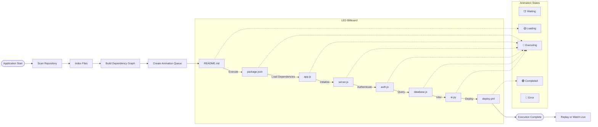
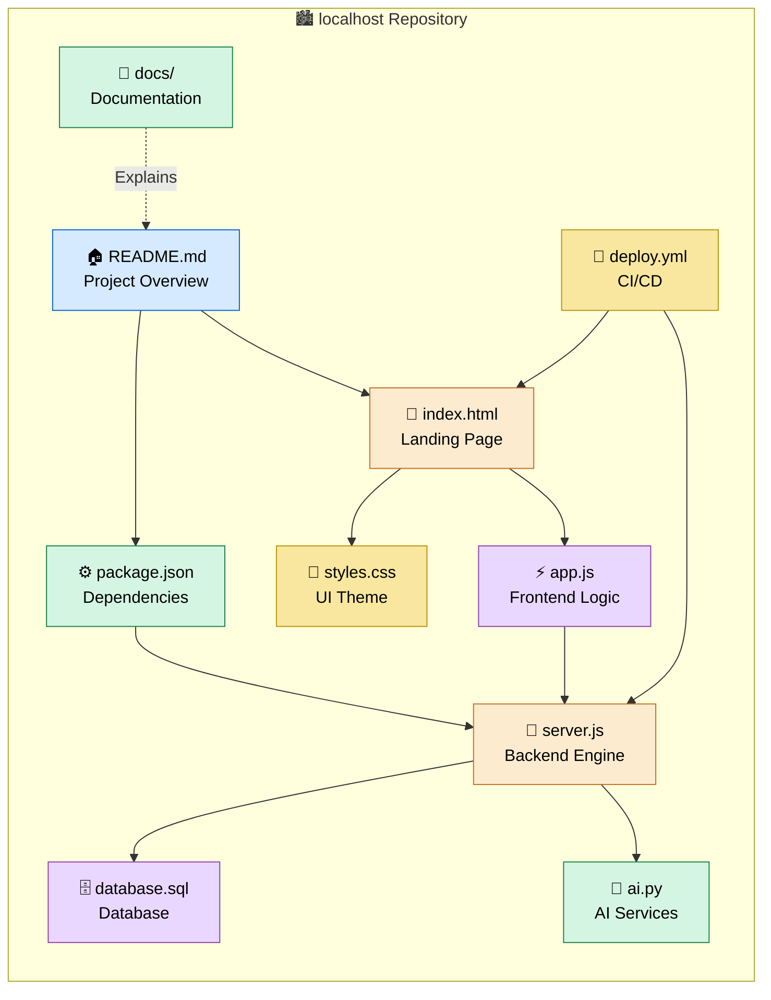
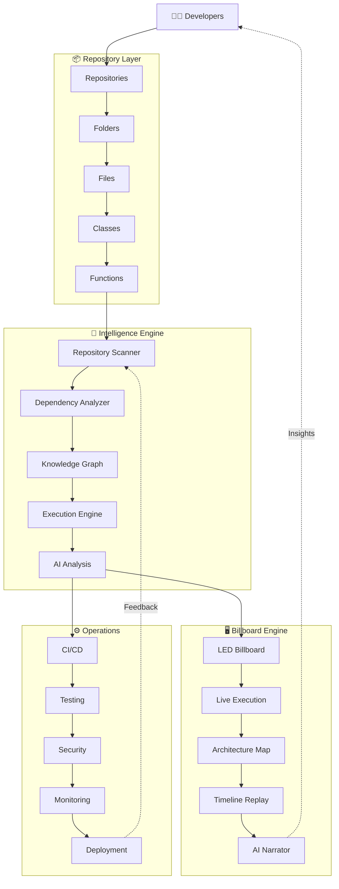
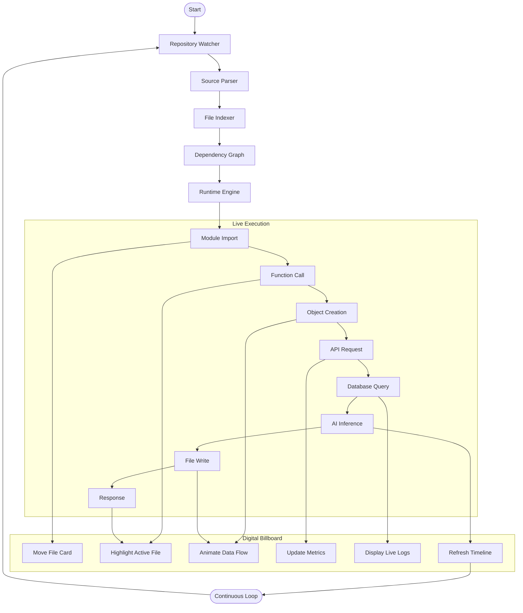

# localhost



This is still a logical view. In the actual application, the animation would make it feel like a digital billboard:

* Files continuously scroll across the screen.
* The active file grows larger and glows.
* Animated light trails show execution flowing from one file to another.
* Completed files slide away while new ones enter.
* A ticker at the bottom displays logs in real time.
* Users can pause, replay, zoom, or click any file for details.



Here’s a Mermaid diagram for the next phase of the Here’s a Mermaid diagram for the next phase of the architecture:

This version is compatible with GitHub Mermaid and avoids advanced styling that can break rendering.




This version is compatible with GitHub Mermaid and avoids advanced styling that can break rendering.

ll


```svg
                     REPO BILLBOARD ENGINE
         GitHub Repository
                │
                ▼
      Repository Scanner
                │
      ┌─────────┴─────────┐
      ▼                   ▼
 Dependency Graph     File Metadata
      │                   │
      └─────────┬─────────┘
                ▼
        Execution Simulator
                │
     WebSocket Event Stream
                │
                ▼
     ┌────────────────────────────┐
     │    LED Billboard Engine    │
     │                            │
     │ README.md    package.json  │
     │        ↘      ↓            │
     │       app.js → server.js   │
     │            ↓               │
     │       database.js          │
     │            ↓               │
     │          ai.py             │
     │                            │
     │ ◉ Active                   │
     │ ➜ Executing                │
     │ ✓ Complete                 │
     │ ⚠ Error                    │
     └────────────────────────────┘

```
Then make it feel like a real LED billboard:

* 🟢 Files slide in from the right.
* 🔵 Active files pulse with a neon glow.
* 🟣 Dependency lines animate with moving light.
* 🟡 Data packets travel between connected files.
* 🔴 Errors flash briefly.
* ⚪ Completed files fade into the background.
* 📈 Live metrics appear in side panels.
* 📢 A bottom ticker streams logs in real time.

You could also add:

* A 3D city mode where files are skyscrapers and execution is represented by moving lights.
* A subway map mode where each programming language has its own colored line.
* A galaxy mode where repositories are planets and files orbit them.
* A matrix mode with flowing code and execution highlights.
* A mission control mode resembling a spacecraft operations center.

For the localhost repository, the system could automatically:

1. Scan every file.
2. Detect imports and dependencies.
3. Build the execution graph.
4. Simulate or observe execution.
5. Animate the flow live.

This could be packaged as an open-source project, for example:

* RepoVision — Live repository visualization.
* CodeBillboard — Animated code execution display.
* RepoLive — Real-time repository explorer.
* FlowBoard — Execution flow dashboard.
* QUBUHUB Vision — Interactive software architecture viewer.

The result would be more than documentation: it would be a visual operating system for understanding how a codebase works in motion.


The next step is to make it interactive and intelligent, so the visualization isn’t just an animation—it accurately reflects what’s happening in the repository.

Layer 1 — Repository Scanner

Every file is indexed.

localhost/
 ├── README.md
 ├── package.json
 ├── src/
 ├── docs/
 ├── ai/
 ├── api/
 └── tests/

Each file gets metadata such as:

* Language
* Size
* Dependencies
* Functions/classes
* Last modified
* Git history

⸻

Layer 2 — Dependency Engine

The engine automatically discovers relationships.

app.js
 ├── imports auth.js
 ├── imports config.js
 ├── imports server.js
server.js
 ├── imports routes.js
 └── imports database.js

It builds a live graph without manual configuration.

⸻

Layer 3 — Execution Engine

Instead of simply highlighting files, the engine follows the actual execution path.

README
      ↓
package.json
      ↓
app.js
      ↓
server.js
      ↓
database.js
      ↓
AI Engine

Only the currently executing components are illuminated.

⸻

Layer 4 — Billboard Renderer

The display resembles a giant LED screen.

□□□□□□□□□□□□□□□□□□□□□□□□□□□□□□□□□□□□□
 README.md
            ▶ app.js
                      ▶ server.js
 auth.js ◉
 database.js
□□□□□□□□□□□□□□□□□□□□□□□□□□□□□□□□□□□□□

Everything moves smoothly, as if displayed on a stadium or city-center digital billboard.

⸻

Layer 5 — Live Intelligence

Instead of static boxes, each file becomes a live information card.

server.js
Status: Running
CPU: 3%
Memory: 42 MB
Requests: 192
Dependencies: 8
Health: Excellent

The card updates continuously.

⸻

Layer 6 — Timeline

A timeline lets users move through execution history.

12:10:01  README
12:10:03  package.json
12:10:04  app.js
12:10:05  auth.js
12:10:05  database.js
12:10:06  response sent

Users can scrub backward or replay the sequence.

⸻

Layer 7 — AI Narrator

An AI component explains what’s happening in plain language as the visualization runs:

“The application has started. package.json loaded dependencies. app.js initialized the server. server.js accepted a request and passed it to the authentication module. The database query completed successfully.”

This makes the visualization valuable for onboarding, debugging, architecture reviews, and demonstrations.

At that point, the project evolves from a code viewer into a live software operations center that visually explains how an application is structured and behaves while it runs.

Yes. The first executable milestone is to build an MVP (minimum viable product) rather than trying to implement every feature at once.

Phase 1: Repository Scanner

repo-billboard/
├── backend/
│   ├── scanner/
│   ├── analyzer/
│   ├── execution/
│   └── websocket/
├── frontend/
│   ├── billboard/
│   ├── animation/
│   ├── dashboard/
│   └── assets/
├── shared/
├── docs/
└── config/

Phase 2: Scan the Repository

The scanner walks through every file:

localhost/
 ├── README.md
 ├── package.json
 ├── server.js
 ├── app.js
 ├── database.js
 └── ai.py

It generates metadata like:

{
  "name": "server.js",
  "language": "JavaScript",
  "imports": [
    "database.js",
    "routes.js"
  ],
  "size": 12458,
  "functions": 17
}

⸻
```f#
Phase 3: Build the Graph

README
      │
      ▼
package.json
      │
      ▼
app.js
  ├──────────▶ auth.js
  ├──────────▶ server.js
  │               │
  ▼               ▼
config.js    database.js
                  │
                  ▼
               ai.py

⸻

: Billboard Animation

Every few milliseconds:

README      ◉
package.json
server.js
database.js

↓

README
package.json     ◉
server.js
database.js

↓

README
package.json
server.js        ◉
database.js
```
The active file pulses while others continue scrolling across the display.

⸻

Phase 5: Live Event Stream

As execution progresses:
```console
▶ Loading README.md...
▶ Reading package.json...
▶ Initializing server.js...
▶ Opening database connection...
▶ Loading AI module...
▶ Listening on port 8080...
```
⸻

Phase 6: Control Panel

[▶ Play]
[⏸ Pause]
[⟳ Replay]
[⏩ Fast Forward]
[🔍 Search]
[🗺 Architecture]

⸻

Phase 7: AI Assistant

A side panel continuously explains what’s happening:

AI Assistant
The server is starting.
database.js has established a connection.
Authentication middleware is active.
API routes are ready.
No errors detected.

Target Architecture
```fof
GitHub Repository
        │
        ▼
 Repository Scanner
        │
        ▼
 Dependency Analyzer
        │
        ▼
 Execution Engine
        │
        ▼
 Event Stream
        │
        ▼
 Billboard Renderer
        │
        ▼
 AI Narrator
```
The next phase is to transform the billboard into a live execution operating system for software.

Phase 8 — Runtime Capture

Instead of simulating execution, capture it live.

GitHub Repo
      │
      ▼
Static Scanner
      │
      ▼
Runtime Hooks
      │
      ▼
Live Execution Events
      │
      ▼
Billboard Engine

The engine observes:

* Function calls
* Module imports
* API requests
* Database queries
* File reads/writes
* Process creation
* Errors and exceptions

⸻

Phase 9 — Smart Camera

The billboard automatically focuses on the busiest area.

Entire Repository
README
package
server
auth
database
AI
tests
        ↓
Camera zooms to
server.js
     │
database.js
     │
AI Engine

The “camera” moves to where the action is happening.

⸻

Phase 10 — Multiple Billboards

One billboard isn’t enough for large systems.
```ascii
┌──────────────────┐
│ Frontend         │
└──────────────────┘
┌──────────────────┐
│ Backend          │
└──────────────────┘
┌──────────────────┐
│ Database         │
└──────────────────┘
┌──────────────────┐
│ AI               │
└──────────────────┘
┌──────────────────┐
│ Infrastructure   │
└──────────────────┘
```
Each area has its own live display.

⸻

Phase 11 — Digital Twin

The billboard becomes a digital twin of the repository.

Every file has:

* Status
* Health
* Dependencies
* Execution count
* Performance metrics
* Memory usage
* Error rate

Selecting a file opens its live telemetry.

⸻

Phase 12 — Time Travel

Replay execution from any point.
```au3
08:14:00 Start
08:14:01 app.js
08:14:02 server.js
08:14:03 auth.js
08:14:04 database.js
08:14:05 Response Sent
```
Move backward or forward to inspect what happened.

⸻

Phase 13 — AI Copilot

An AI continuously analyzes the execution stream:

* Detects bottlenecks.
* Suggests optimizations.
* Highlights dead code.
* Explains execution paths.
* Predicts likely failures.
* Recommends refactoring opportunities.

⸻

Phase 14 — Global Repository Map

Imagine every repository as a building in a city.
```svg
                 QUBUHUB
          ┌──────────────┐
          │ localhost    │
          └──────┬───────┘
                 │
        ┌────────┴─────────┐
        ▼                  ▼
     NextN            AI Models
        │                  │
        ▼                  ▼
     Web4              Blockchain
        │                  │
        └──────────┬───────┘
                   ▼
              Deployment
```
Execution traffic flows between repositories just as it flows between files within a repository.
The **Web Install API** (implemented in Chromium under `third_party/blink/renderer/modules/web_install/`) allows web applications or app-store sites to trigger the installation of a Progressive Web App (PWA).

How it works depends on whether you are **testing/using the API as a developer** or **compiling the Chromium engine**.

---

## 1. Web Developers: Using `navigator.install()`

The API provides programmatic installation without relying on legacy events like `beforeinstallprompt`.

### JavaScript Usage

```javascript
// Check if the Web Install API is supported
if ('install' in navigator) {
  try {
    // 1. Install the current site as a PWA
    await navigator.install();
    console.log("App installed successfully!");
  } catch (err) {
    console.error("Installation failed or was rejected:", err);
  }
}

```

You can also pass arguments to install another page or application from a supported origin:

```javascript
// 2. Install a specific web app via URL and manifest ID
await navigator.install(
  new URL("https://example.com/app"), 
  "https://example.com/manifest.json#appid"
);

```

### Enabling the Feature Flag

Since the API is experimental across Chromium browsers (Chrome/Edge):

1. Open **`chrome://flags`** (or `edge://flags`) in your browser.
2. Search for **Web App Installation API** (or `#web-app-installation-api`).
3. Set it to **Enabled** and restart the browser.

---

## 2. Browser Engine Developers: Building the Blink Module

If you are modifying the Chromium C++ codebase directly (`third_party/blink/renderer/modules/web_install/`):

### Build Configuration (`args.gn`)

Ensure Web App installation flags are active in your Chromium build target:

```gn
# Enable experimental Web Platform features in your build
enable_web_app_installation = true

```

### Module Architecture in Chromium

When `navigator.install()` is called in JavaScript:

1. **Blink Renderer (`modules/web_install/`)**: `navigator_web_install.cc` validates the request (e.g., checks if triggered by a user gesture).
2. **Mojo IPC (`web_install.mojom`)**: The request is passed from Blink to the browser process via a Mojo interface.
3. **Browser Process (`//chrome/browser/web_applications/`)**: `web_install_service_impl.cc` fetches the app manifest, checks permissions, and presents the native installation dialog to the user.


End Vision

The finished system isn’t just a code viewer. It’s a software command center where every repository, service, file, and function is represented as a living, animated system. Developers can watch code execute, trace interactions, diagnose problems, and understand architecture visually, all in real time. For a large ecosystem like yours, it could provide a unified view spanning multiple repositories and services.

The next stage is where the idea becomes a full Software Digital Universe rather than just a repository visualizer.

Phase 15 — Function-Level Visualization

Don’t stop at files. Every function becomes an object.
```pq
Repository
    │
    ├── app.js
    │      ├── init()
    │      ├── login()
    │      └── logout()
    │
    └── server.js
           ├── start()
           ├── middleware()
           └── route()
```
During execution:

init() ●────────▶ middleware() ●────────▶ route()

Every function lights up as it runs.

⸻

Phase 16 — Data Flow

Instead of only showing execution, show the data moving.
```ttl
User
  │
  ▼
API
  │
  ▼
Authentication
  │
  ▼
Database
  │
  ▼
AI Model
  │
  ▼
Response
```
Data packets travel between components as animated streams.

⸻

Phase 17 — Event Universe

Everything becomes an event.

File Opened
Module Imported
API Called
Database Queried
Cache Hit
AI Generated
File Saved
Commit Created
Deployment Started
Deployment Finished

The billboard is driven by an event stream rather than polling.

⸻

Phase 18 — Repository Brain

Create a semantic understanding of the project.

Instead of only knowing:

server.js

the system knows:

“This is the HTTP entry point responsible for routing authenticated requests.”

Every file gains meaning, not just a name.

⸻

Phase 19 — Living Documentation

Documentation updates automatically.

When code changes:

* Architecture diagrams update.
* Dependency maps update.
* API documentation regenerates.
* Execution maps refresh.
* Performance dashboards reflect the latest behavior.

No manual maintenance required.

⸻

Phase 20 — Ecosystem View

Scale beyond one repository.

```haic
                QUBUHUB
      localhost ───── NextN
           │             │
           ▼             ▼
      AI Engine ─── Blockchain
           │             │
           └──────┬──────┘
                  ▼
             Web4 Network
```
Developers can follow requests as they move across repositories and services.

⸻

Phase 21 — Immersive Modes

Offer multiple visualizations depending on the task:

* Billboard Mode – LED-style animated panels.
* Architecture Mode – Dependency graph.
* Mission Control – Operations dashboard.
* Timeline Mode – Replay execution.
* Heatmap Mode – Most active files/functions.
* City Mode – Files as buildings.
* Galaxy Mode – Repositories as planets.
* Circuit Mode – Components connected like an electronic board.

⸻

Phase 22 — Autonomous Insights

The system becomes proactive.

It notices patterns such as:

* A dependency cycle has appeared.
* A function has become a performance hotspot.
* A service is rarely used.
* An API endpoint is failing more often.
* A file has become unusually complex.

Instead of waiting for a developer to ask, it surfaces these observations as they emerge.

At this stage, the project evolves from a visualization tool into an intelligent engineering platform that combines architecture discovery, live execution, documentation, and operational insight in a single interface.

The next milestone is to turn the platform into a software operating environment, where the visualization is not only informative but also interactive.

Phase 23 — Command Mode

Every element on the billboard can be acted upon.

server.js
──────────────
▶ Run
⏸ Pause
🔄 Restart
🧪 Test
📖 Open Docs
✏ Edit
📊 Metrics

Clicking a file doesn’t just show information—it lets you perform relevant actions.

⸻

Phase 24 — Multi-User Collaboration

Represent each developer as a live participant.

👤 Alice  → editing auth.js
👤 Bob    → reviewing api.js
👤 Carol  → deploying
🤖 AI     → generating tests

You can see who is working where in real time.

⸻

Phase 25 — Live Build Pipeline

Visualize the build process.
```csl
Code
 │
 ▼
Lint
 │
 ▼
Tests
 │
 ▼
Build
 │
 ▼
Package
 │
 ▼
Deploy
```
Each stage lights up as it progresses and reports success or failure.

⸻

Phase 26 — System Health

A dashboard summarizes repository health at a glance:
```3D
Repository Health
🟢 Build
🟢 Tests
🟢 Security
🟡 Performance
🟢 Documentation
🔴 Deployment Queue
```
⸻

Phase 27 — AI Engineering Assistant

The AI observes development and offers contextual suggestions:

* Explain a module.
* Summarize recent changes.
* Identify duplicated code.
* Recommend refactors.
* Generate missing tests.
* Trace the impact of a proposed change.

Suggestions appear alongside the affected files rather than interrupting the workflow.

⸻

Phase 28 — Plugin Architecture

Make the billboard extensible.

Plugins could add:

* Git integration.
* Issue tracking.
* Security scanning.
* Performance profiling.
* Cloud deployment status.
* AI model monitoring.
* Blockchain transaction visualization.

⸻

Phase 29 — Repository Simulation

Run “what-if” scenarios without modifying the codebase.

Examples:

* “What happens if this dependency is removed?”
* “What breaks if this service is offline?”
* “How would request flow change if this cache were enabled?”

The billboard animates the simulated outcome.

⸻

Phase 30 — Ecosystem Command Center

The final step is to connect every repository into a single live environment.
```xlsl
                    QUBUHUB
          ┌──────── localhost ────────┐
          │                           │
       NextN                    AI Services
          │                           │
     Blockchain                Documentation
          │                           │
          └──────── Deployment ───────┘
                     │
                     ▼
              Global Operations View
```
Instead of opening repositories one at a time, you monitor and interact with the entire software ecosystem from one interface. Requests, deployments, AI activity, and operational health are all visible in a unified, animated command center. This creates a platform that serves as both a development tool and a live architectural overview of complex systems.


From this point, the project shifts from a repository tool into a software metaverse—a digital twin of an entire engineering ecosystem.

Phase 31 — Universal Knowledge Graph

Everything becomes a connected node.
```svg
Developer
     │
     ▼
Repository
     │
     ▼
Folder
     │
     ▼
File
     │
     ▼
Class
     │
     ▼
Function
     │
     ▼
Variable
     │
     ▼
API
     │
     ▼
Database
```
Now the system understands not only what exists, but how everything relates.

⸻

Phase 32 — Continuous Memory

The platform remembers repository history.

Examples:

* When a file first appeared.
* Why a function changed.
* Which deployment introduced a bug.
* How architecture evolved over time.

This creates an engineering timeline.

⸻

Phase 33 — Autonomous Documentation

Documentation is generated and maintained automatically.

Every code change updates:

* API docs.
* Architecture diagrams.
* Dependency maps.
* Developer guides.
* Changelogs.

Documentation stays synchronized with the codebase.

⸻

Phase 34 — AI Engineering Team

Instead of one assistant, specialized agents collaborate.
```aduino
┌──────────────────────────────┐
│ Architect AI                 │
│ Designs systems              │
└──────────────────────────────┘
┌──────────────────────────────┐
│ Security AI                  │
│ Reviews vulnerabilities      │
└──────────────────────────────┘
┌──────────────────────────────┐
│ Test AI                      │
│ Generates and runs tests     │
└──────────────────────────────┘
┌──────────────────────────────┐
│ Documentation AI             │
│ Updates manuals and diagrams │
└──────────────────────────────┘
┌──────────────────────────────┐
│ Performance AI               │
│ Finds bottlenecks            │
└──────────────────────────────┘
```
⸻

Phase 35 — Predictive Engineering

Before merging a change, the system estimates its impact.

For example:

* Likely affected modules.
* Performance implications.
* Test coverage changes.
* Deployment risk.
* Dependency conflicts.

The goal is to surface likely consequences early.

⸻

Phase 36 — Universal Dashboard

Bring everything together in one interface:
```md
* Repository billboard.
* Live execution.
* Architecture map.
* CI/CD status.
* AI insights.
* Security findings.
* Performance metrics.
* Documentation.
* Collaboration.
```
One dashboard becomes the operational view of the software ecosystem.

⸻

Phase 37 — SDK

Expose the platform so other tools can integrate.

Example APIs:
```txt
scanRepository()
buildDependencyGraph()
streamExecution()
getArchitecture()
analyzePerformance()
generateDocumentation()
```
This allows IDEs, CI pipelines, and third-party services to consume the same data.

⸻

Phase 38 — Ecosystem Scale

The final evolution is to treat all repositories, services, and infrastructure as one connected system.
```xq
Developers
      │
      ▼
Repositories
      │
      ▼
Build Pipelines
      │
      ▼
Deployments
      │
      ▼
Running Services
      │
      ▼
Users
      │
      ▼
Telemetry
      │
      └───────────────┐
                      ▼
             AI Analysis Engine
                      │
                      ▼
          Continuous Improvements
```

The next layer is the Execution Core, showing how every execution event flows into the billboard. This keeps the visualization synchronized with the actual application state.



This diagram establishes a continuous feedback loop:

1. The repository is watched for changes.
2. The code is parsed and indexed.
3. The runtime emits execution events.
4. The billboard updates in real time.
5. The loop repeats as the application evolves.
 logical diagram would model the Billboard Rendering Pipeline itself—how file cards are created, animated, prioritized, and removed from the display. That pipeline is where the “digital advertising billboard” effect is actually produced.


Now we design the Billboard Rendering Pipeline. This is the component that makes the repository feel like a giant LED advertising screen.

```mermaid
flowchart LR
    EVENT[Execution Event]
    EVENT --> QUEUE[Animation Queue]
    QUEUE --> PRIORITY[Priority Scheduler]
    PRIORITY --> CARD[Generate File Card]
    CARD --> STYLE[Apply Theme]
    STYLE --> EFFECT[LED Effects]
    EFFECT --> MOTION[Motion Engine]
    subgraph SCREEN["Digital Billboard"]
        S1[Slide In]
        S2[Expand]
        S3[Glow]
        S4[Execute]
        S5[Transfer Data]
        S6[Fade]
        S7[Archive]
    end
    MOTION --> S1
    S1 --> S2
    S2 --> S3
    S3 --> S4
    S4 --> S5
    S5 --> S6
    S6 --> S7
    S7 --> CLEAN[Cleanup]
    CLEAN --> READY[Ready For Next File]
    READY --> QUEUE
%% Styling
classDef repo fill:#d6eaff,stroke:#0366d6,color:#000;
classDef deploy fill:#d5f5e3,stroke:#1e8449,color:#000;
classDef dns fill:#fdebd0,stroke:#ca6f1e,color:#000;
classDef monitor fill:#f9e79f,stroke:#b7950b,color:#000;
classDef ai fill:#ead7ff,stroke:#8e44ad,color:#000;

class A repo;
class B,H,J deploy;
class C,D dns;
class E,I monitor;
class F,G ai;
```

File Card Layout
```svg
┌─────────────────────────────────────┐
│ app.js                              │
├─────────────────────────────────────┤
│ Status     : Executing              │
│ Language   : JavaScript             │
│ Dependencies: 14                    │
│ Runtime    : 18 ms                  │
│ CPU        : 3%                     │
│ Memory     : 41 MB                  │
├─────────────────────────────────────┤
│ ▶ Initializing Express              │
└─────────────────────────────────────┘
```
Animation Sequence
```webp
Slide In
      ↓
Expand
      ↓
Glow
      ↓
Execute
      ↓
Show Data Flow
      ↓
Complete
      ↓
Shrink
      ↓
Leave Screen

Multiple Files

README.md
        ↓
package.json
        ↓
app.js
        ↓
server.js
        ↓
database.js
        ↓
AI Engine
```
Each file moves independently, just like advertisements rotating on a digital billboard, while the active file receives visual emphasis.

Where this leads next

The next stage is the Cinematic Engine, which controls camera movement rather than just file movement. Instead of a fixed view, the display can:

* Pan to the busiest part of the graph.
* Zoom into the active execution path.
* Follow data as it flows between modules.
* Rotate or rearrange the layout dynamically.
* Transition smoothly between architecture, execution, and metrics views.

That is what gives the visualization the polished feel of a professional operations dashboard rather than a static graph.
Yes. The more advanced approach is to treat the README and docs/mmd.md as data sources and generate SVG elements from them.

The architecture looks like this:

README.md
        │
        ▼
   Markdown Parser
        │
        ▼
 Mermaid Detection
        │
        ▼
 SVG Generator
        │
        ▼
 Animated Repository Billboard

The basic JavaScript flow is:
```js
const BASE = "https://raw.githubusercontent.com/auraecosystem/localhost/main";
async function loadFile(path) {
    return await fetch(`${BASE}/${path}`).then(r => r.text());
}
async function buildBillboard() {
    const readme = await loadFile("README.md");
    const mmd = await loadFile("docs/mmd.md");
    // Extract Mermaid code blocks
    const mermaids = [...readme.matchAll(/```mermaid([\s\S]*?)```/g)]
        .map(m => m[1]);
    // Do the same for docs/mmd.md
    mermaids.push(
        ...[...mmd.matchAll(/```mermaid([\s\S]*?)```/g)]
            .map(m => m[1])
    );
    console.log(mermaids);
}
buildBillboard();
```
Then render each Mermaid diagram into SVG:
```html
<script type="module">
import mermaid from "https://cdn.jsdelivr.net/npm/mermaid@11/dist/mermaid.esm.min.mjs";
mermaid.initialize({
    startOnLoad: false,
    theme: "dark"
});
const { svg } = await mermaid.render("repoDiagram", mermaids[0]);
document.getElementById("svg-container").innerHTML = svg;
</script>
```
Once the SVG is generated, you can:

* Animate glowing “file packets” moving along Mermaid edges.
* Highlight nodes as files execute.
* Pulse directories when activity occurs.
* Show commit and build events.
* Update the diagram automatically when the repository changes.

This produces the “living repository billboard” concept you described, where the README’s Mermaid workflows are no longer static—they become animated, interactive SVG graphics integrated into your dashboard.

